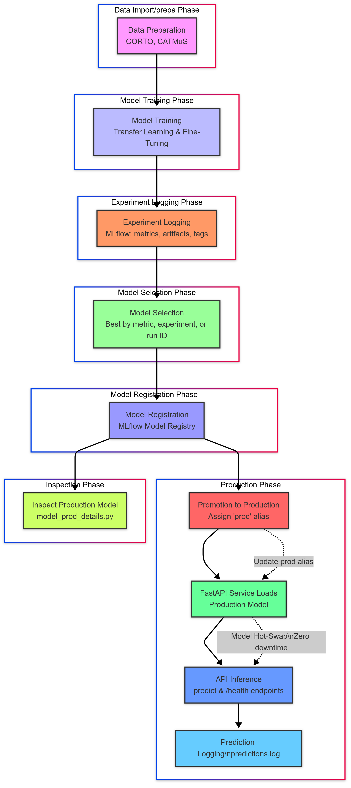

# Project Documentation

## Overview

ML pipeline for document image classification (handwritten vs. printed). It leverages open-source datasets, several training strategies (transfer learning and fine-tuning), and MLflow for experiment tracking, model registry, and deployment. The system exposes a FastAPI web service for inference.

---

## Features

- **Image Classification**: Binary classification (handwritten vs. printed).

- **Open Data Integration**: Uses Open Source datasets for both handwritten and printed text.
- **Experiment Management**: MLflow tracks all experiments, metrics, artifacts, and model versions.
- **Flexible Model Selection**: Register the best model globally, from all/selected experiments, or by run ID.
- **Model Registry & Promotion**: Automated registration and promotion to production using MLflow Model Registry and aliases.
- **FastAPI Web Service**: API for health checks and predictions.
- **Interpretability (just in jupyter)**: Grad-CAM and Occlusion for model explainability.
- **Dockerized Deployment**: Consistent, reproducible environments.

---

## Project Layout

```plaintext
          /
├── app/
│   ├── config.py
│   ├── main.py
│   ├── webservice.py
│   ├── inference/
│   │   ├── inference_onnx.py
│   │   ├── inference.ipynb
│   │   ├── model_prod_details.py
│   │   ├── model_registry_prod_experiments.py
│   ├── training/
│   │   ├── training_experiments.ipynb
│   │   └── mlruns/
│   ├── data/
│   │   ├── data_import_handwritten_CORTO.py
│   │   ├── data_import_printed_handwritten_CATMUS.py
│   │   └── datasets/
│   └── webservice_predictions/
│       └── predictions.log
├── documentation/
│   └── docs/
│       └── index.md
├── docker-compose.yml
├── Dockerfile
└── README.md
```

---

## Dataset Details
Two datasets were explored but just CATMuS modern was selected as we have examples for 2 classes, but the single class dataset was used for some examples and to test the model. 

### Handwritten Text Images
- **Source**: [Corto-AI Handwritten Text Dataset](https://huggingface.co/datasets/corto-ai/handwritten-text)
- **Description**: Grayscale images of handwritten text, extracted from Parquet files and saved as PNG.
- **Processing**:
  - Split into `train`, `validation`, and `test`.
  - Label: `handwritten` (class `0`).
  - See [`data_import_handwritten_CORTO.py`](../../app/data/data_import_handwritten_CORTO.py) for preprocessing logic.

### Printed and Handwritten Text Images
- **Source**: [CATMuS Modern Dataset](https://huggingface.co/datasets/CATMuS/)
- **Description**: RGB images of both printed and handwritten text.
- **Processing**:
  - Organized by writing type (`handwritten` or `printed`).
  - Split into `train`, `validation`, and `test`.
  - Labels: `handwritten` (class `0`), `printed` (class `1`).
  - See [`data_import_printed_handwritten_CATMUS.py`](../../app/data/data_import_printed_handwritten_CATMUS.py).

- **Data Handling**:
  - All data is loaded and preprocessed using custom scripts.
  - Data augmentation and normalization are applied during training.

---

## Training Logic

### Model Architecture

- **Base Model**: MobileNetV2 (pretrained on ImageNet).
- **Transfer Learning**:
  - Freezed convolutional and some other layers to retain pretrained features.
  - Replace classifier with a custom linear layer for binary classification.
- **Fine-Tuning**:
  - Optionally unfreezed specific last layers for further adaptation.
  - Multiple fine-tuned models can were trained with different layers, epochs, lr or data splits.

### Training Process

1. **Data Augmentation**:
   - Resize to `256x1024`.
   - Random rotations, color jitter, normalization.
2. **Subset Creation**:
   - Optionally set a subset (e.g., 10%) for rapid training and testing.
3. **Loss Function**:
   - Cross-Entropy Loss.
4. **Optimizer**:
   - Adam with `ReduceLROnPlateau` scheduler (monitors validation loss).
5. **Classification Metrics**:
   - Accuracy, Precision, Recall, F1 Score, ROC AUC, Confusion Matrix.
   - Metrics are logged per epoch and at test time.
6. **Logging**:
   - **MLflow** logs:
     - Parameters, metrics, artifacts (models, plots, transforms, sample datasets).
     - See [`training_experiments.ipynb`](../../app/training/training_experiments.ipynb) for full logic.
   - **Artifacts**:
     - PyTorch model (`.pth`), ONNX model, preprocessing transforms, sample datasets, plots.

### Experiment Tracking and Model Registry

Applies for model and corresponding transformation/preprocessing (saved in .pckl format for reuse during inference).

- **MLflow Tracking**:
  - All experiments are tracked in [`mlruns/`](../../app/training/mlruns/).
  - Each run logs metrics, parameters, and artifacts.
  - Experiments can be created for different strategies (transfer learning, fine-tuning, etc.).

- **Model Selection & Registration**:
  - Use [`model_registry_prod_experiments.py`](../../app/inference/model_registry_prod_experiments.py) to:
    - Find the best run by a target metric (default: `validation_accuracy`) across all or selected experiments.
    - Optionally, select a specific experiment or run ID.
    - Register the best model(s) in the MLflow Model Registry.
    - Set tags (including dataset and model descriptions).
    - Promote the best version to production using the `prod` alias.
  - The logic supports:
    - **Global best**: Best model from all experiments.
    - **Experiment best**: Best model from a specific experiment.
    - **Manual selection**: Register a model by run ID.

- **Model Promotion**:
  - The latest/best version is assigned the `prod` alias.
  - Previous production models are archived.
  - See [`promote_to_production`](../../app/inference/model_registry_prod_experiments.py) for details.

- **Production Model Details**:
  - Use [`model_prod_details.py`](../../app/inference/model_prod_details.py) to inspect the current production model, including metrics, parameters, tags, and registration time.

---

## Inference & FastAPI Web Service

- **Model Loading**:
  - The FastAPI service loads the production model from the MLflow Model Registry using the `prod` alias.
  - Preprocessing transforms are loaded from the corresponding artifact.

- **Endpoints**:
  - `/health`: Returns model status, version, and alias.
  - `/predict/`: Accepts an image file and returns the predicted class, confidence, model version, and alias.

- **Logging**:
  - All predictions are logged to `webservice_predictions/predictions.log` for traceability.

- **Error Handling**:
  - Robust error handling for model loading, prediction, and file logging.
  - See [`webservice.py`](../../app/webservice.py) and [`main.py`](../../app/main.py).

---

## Interpretability (just a try in jupyter notebook)

The idea was to implement model Interpretability if prediction proba / confidence is low. 
Perhaps a good idea to implement as another service.

- **Grad-CAM**:
  - Visualizes important regions for each class using the last convolutional layer.
- **Occlusion**:
  - Systematically occludes image regions to identify areas critical for classification.
- **Usage**:
  - Both techniques are implemented for model debugging and transparency.

---

## Experiment Management Workflow

1. **Train Models**:
   - Run experiments in [`training_experiments.ipynb`](../../app/training/training_experiments.ipynb).
   - Each run is tracked in MLflow with full metrics and artifacts.

2. **Select Best Model(s)**:
   - Use [`model_registry_prod_experiments.py`](../../app/inference/model_registry_prod_experiments.py) to:
     - Automatically select the best run by metric.
     - Register and promote to production.
     - Optionally, select by experiment or run ID.

3. **Inspect Production Model**:
   - Use [`model_prod_details.py`](../../app/inference/model_prod_details.py) to view details of the current production model.

4. **Deploy FastAPI Service**:
   - The service always loads the current production model.
   - Supports hot-swapping models by updating the `prod` alias in MLflow.

---

<!-- ...existing documentation... -->

---

## Experiment Management Workflow

1. **Train Models**:
   - Run experiments in [`training_experiments.ipynb`](../../app/training/training_experiments.ipynb).
   - Each run is tracked in MLflow with full metrics and artifacts.

2. **Select Best Model(s)**:
   - Use [`model_registry_prod_experiments.py`](../../app/inference/model_registry_prod_experiments.py) to:
     - Automatically select the best run by metric.
     - Register and promote to production.
     - Optionally, select by experiment or run ID.

3. **Inspect Production Model**:
   - Use [`model_prod_details.py`](../../app/inference/model_prod_details.py) to view details of the current production model.

4. **Deploy FastAPI Service**:
   - The service always loads the current production model.
   - Supports hot-swapping models by updating the `prod` alias in MLflow.

---
## Step-by-Step: Model Lifecycle from Training to Production

This section details the full lifecycle of a model in the project, from initial training to production inference.

Before going into detail, below is a visual summary of the model lifecycle from training to production:



### 1. Data Preparation

- **Handwritten Data**: Loaded and preprocessed via [`data_import_handwritten_CORTO.py`](../../app/data/data_import_handwritten_CORTO.py).
- **Printed & Handwritten Data**: Loaded and preprocessed via [`data_import_printed_handwritten_CATMUS.py`](../../app/data/data_import_printed_handwritten_CATMUS.py).
- **Splitting**: Both datasets are split into train, validation, and test sets.
- **Transforms**: Custom PyTorch transforms (resize, normalization, augmentation) are defined and saved as artifacts for reproducibility.

### 2. Model Training & Experiment Logging

- **Architecture**: MobileNetV2 (pretrained on ImageNet) is used as the base model.
- **Transfer Learning**: Initial experiments freeze most layers, replacing the classifier for binary output.
- **Fine-Tuning**: Additional experiments unfreeze more layers, tuning with different hyperparameters (epochs, learning rate, data splits).
- **Training Loop**: For each experiment:
  - Data is loaded with augmentations.
  - Model is trained and validated per epoch.
  - Metrics (accuracy, precision, recall, F1, ROC AUC, confusion matrix) are computed and logged.
  - Artifacts (PyTorch model, ONNX export, transforms, sample datasets, plots) are logged to MLflow.
  - Each run is tagged with metadata (model description, dataset, hyperparameters).
- **See**: [`training_experiments.ipynb`](../../app/training/training_experiments.ipynb) for full logic.

### 3. Experiment Management & Model Selection

- **All experiments and runs** are tracked in [`mlruns/`](../../app/training/mlruns/).
- **Model selection** is performed using [`model_registry_prod_experiments.py`](../../app/inference/model_registry_prod_experiments.py):
  - **Global Best**: Automatically finds the run with the highest `validation_accuracy` across all experiments.
  - **Experiment Best**: Optionally restricts search to a specific experiment.
  - **Manual Selection**: You can specify a run ID to register a particular model.
- **Artifacts**: The script inspects available artifacts (model, ONNX, transforms) and selects the correct paths for registration.

### 4. Model Registration

- **Registration**: The selected model artifact is registered in the MLflow Model Registry under a chosen name (e.g., `Global_Best_Model`).
- **Tags**: All relevant tags (dataset, model description, hyperparameters) are attached to the registered model.
- **See**: `register_model()` in [`model_registry_prod_experiments.py`](../../app/inference/model_registry_prod_experiments.py).

### 5. Promotion to Production

- **Promotion**: The latest/best model version is assigned the `prod` alias using MLflow’s alias system.
- **Archiving**: Any previous production models are archived automatically.
- **See**: `promote_to_production()` in [`model_registry_prod_experiments.py`](../../app/inference/model_registry_prod_experiments.py).

### 6. Inspecting Production Model

- **Inspection**: Use [`model_prod_details.py`](../../app/inference/model_prod_details.py) to retrieve and log all details of the current production model:
  - Version, run ID, registration time, metrics, parameters, tags.
  - Useful for auditing and debugging.

### 7. FastAPI Web Service Deployment

- **Model Loading**: The FastAPI service loads the production model and preprocessing transforms directly from the MLflow Model Registry using the `prod` alias.
- **Endpoints**:
  - `/health`: Returns model status, version, and alias.
  - `/predict/`: Accepts an image and returns predicted class, confidence, model version, and alias.
- **Logging**: All predictions are logged to `webservice_predictions/predictions.log`.
- **Error Handling**: Robust error handling for model loading, prediction, and logging.
- **See**: [`webservice.py`](../../app/webservice.py) and [`main.py`](../../app/main.py).

### 8. Swaping Models :

- **Zero-downtime updates**: By updating the `prod` alias in MLflow, the FastAPI service will automatically serve the new production model on restart, enabling seamless model upgrades. Also we can check and compare with previous versions using MLflow UI or logs. 

---

## API Endpoints

### Health Check
- **Endpoint**: `/health`
- **Method**: `GET`
- **Description**: Checks the status of the application and model.
- **Response**:
  ```json
  {
    "status": "ok",
    "model_status": "loaded",
    "model_version": "1",
    "model_info": "Alias: prod"
  }
  ```

### Prediction
- **Endpoint**: `/predict/`
- **Method**: `POST`
- **Description**: Classifies an uploaded image as handwritten or printed.
- **Request**:
  - **File**: Image file (e.g., PNG, JPG).
- **Response**:
  ```json
  {
    "image_name": "test_image.png",
    "predicted_class": "printed",
    "confidence": 0.9876,
    "model_version": "1",
    "model_info": "Alias: prod"
  }
  ```

---

## Troubleshooting

### Common Issues
1. **File Logging Not Working**:
   - Ensure the `webservice_predictions` directory exists and has write permissions.
   - Verify the Docker volume mount for `webservice_predictions`.

2. **Model Loading Errors**:
   - Check the MLflow tracking URI and ensure the required artifacts are available.

3. **Docker Build Issues**:
   - Ensure the base image matches your system architecture (e.g., `linux/amd64` for Intel chips).

### Logs
- Console logs are available during runtime.
- Model registry and model in prod logs are stored in `inference/model_deployment_logs/...`.
- Inference/API logs are stored in `webservice_predictions/predictions.log`.

---

## References

- [FastAPI Documentation](https://fastapi.tiangolo.com/)
- [MLflow Documentation](https://mlflow.org/docs/latest/index.html)
- [ONNX Documentation](https://onnx.ai/)
- [Captum Documentation](https://captum.ai/docs/attribution_algorithms)
- [MkDocs Documentation](https://www.mkdocs.org/)